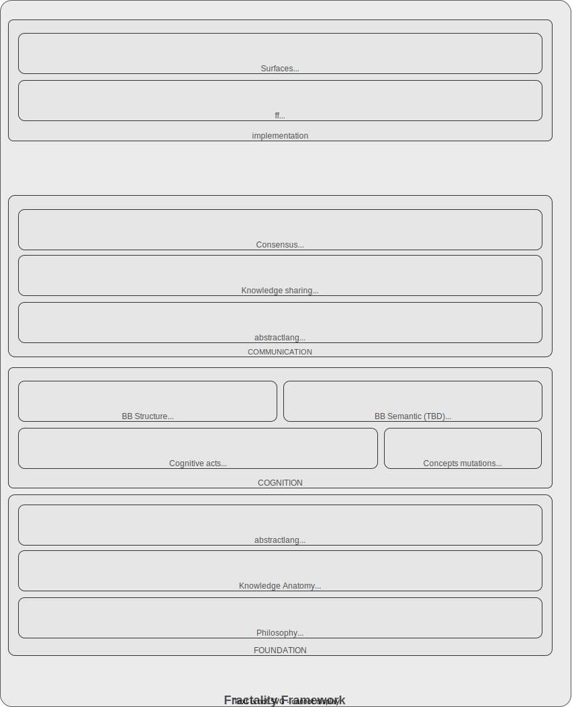

# Fractality Framework

*A framework for knowledge made human and AI friendly*

## FOUNDATION

### Philosophy
Knowledge is personal and bounded. There is no universal interpretation — only persons holding beliefs. We gather and review our beliefs constantly through cognitive work and learning [...more](docs/philosophy.md)

### Knowledge Anatomy
What knowledge is made of. The irreducible unit is a **judgment**: a person's belief that one thing is a concrete case of another [...more](docs/knowledge_anatomy.md)

### Abstractlang core syntax
The syntax of how judgments are written [...more](docs/syntax_core.md)

## COGNITION

### Cognitive acts
Actions person performs to form knowledge [...more](docs/cognitive_acts.md)

### Concepts mutation
Concepts evolve through the experience and larning, but judgments they constitute remains [...more](docs/mutation_concepts.md)

### BB Structure
There is short and struct list of rules which forces BB remain valid through cognition [...more](docs/structure_bb.md)

### BB semantics
TBD [...more](docs/semantics_bb.md)

### abstractlang queries
DRAFT [...more](docs/query_syntax.md)

## COMMUNICATION

### Sharing
Inter-personal sharing knowledge is natrula demnad [...more](docs/sharing.md)

### Consensus
Declaring consensus on inter-personal beliefs shifts them closer to more objective public knowledge [...more](docs/consensus.md)