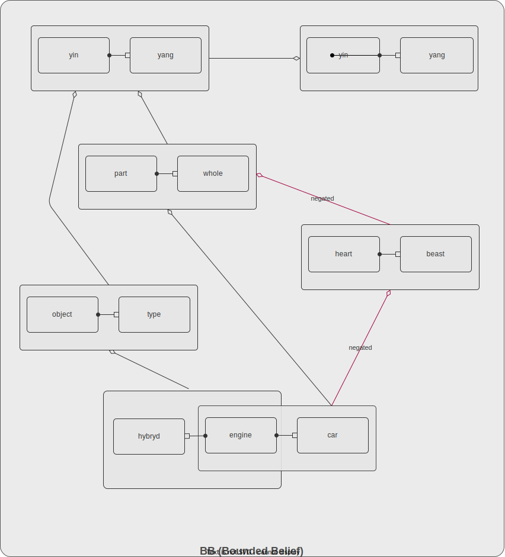

# Knowledge Anatomy

## Judgment — the irreducible unit

Every knowledge system eventually reaches a smallest piece that cannot be split further without losing meaning. In Fractality that unit is the **judgment** — a personal belief that one thing 'declaration' is a concrete case of another 'abstraction'. A judgment always expresses an abstracting relationship between declaration (examplar, object, concretization) and abstraction above least one (class, type, generalization).

> [!IMPORTANT]
> Do not confuse abstracting relationship with composing or similarity ones

## How judgments are formed

Declaration and abstraction are directed relationships each binding two concepts. For example:
* *engine* relates somehow to *car*
* *apartments* relates somehow to *building*
* *part* relates somehow to *whole* 

These relations above are still carries no knowledge itself. But when you bind them into judgments:
* *engine*->*car* exemplifies *part*->*whole* or
* *apartments*->*building* is a concrete case of *part*->*whole*

you do cognitive action resulting into knowledge -- systematic model of the world.

## What is concept

A **concept** is a named, possibly described thing — a piece of the observable world as a person impresses it. Concepts are mutable: a person may refine their understanding of a concept over time without it becoming an entirely different thing, i.e. *engine* is a name of concept and you can describe what you understand under the hood in a free form. Think description could be structed, semi-structed, unstructed data or even media.

As understanding deepens, new judgments follow naturally:
* *engine*->*ICE* is exemplar of *object*->*type*
* *engine*->*electrical* is exemplar of *object*->*type*
* *engine*->*hybrid* is exemplar of *object*->*type*

> [!NOTE]
> It's natural cognitive capability of every person to distinguish when concept changed enaugh to become a new concept.

> [!TIP]
> You can consider this exaple as weird, but remember that knowledge is the result of personal experience and learning.

A **relation** binds two concepts directionally. Relations are not created independently — they exist only as constituents of judgments and carry no knowledge on their own.

## Polarity

Every judgment carries a polarity. A person may hold that something is true — a positive judgment. Or hold that something is false — a negative judgment. Negative judgment is not an absence of knowledge; it is itself a form of knowledge. For examle, someone coud belive:
* -*engine*->*car* exemplifies *part*->*whole* (negated judgment, note '-' sign in front of expression) and contitute:
    * *engine*->*car* is concretization of *heart*->*beast* instead

## Bounded Belief

All of a person's judgments together form their **Bounded Belief (BB)**. From the inside it is simply their knowledge — everything they hold to be true or false. From the outside it is a belief system, awaiting interpersonal validation.

BB is bounded in three ways: by who the person is, by what they care about, and by the limits of what they can cognize. These bounds are not defects — they are what make knowledge personal and meaningful.

Judgments reference each other through shared concepts and relations, forming a network where every judgment traces a path toward a single root which all abstraction originates: *yin*->*yang* is self abstracted by *yin*->*yang*  

## Mutability

In Fractality, mutability follows the nature of things — not convention.

**Judgments are immutable.** A belief, once formed, does not change. When a person changes their mind, they do not edit the old belief — they produce a new one and decide what to do with the old: negate it, reclame it, or retract it entirely. The moment of belief is fixed in time. What changes is which beliefs a person currently holds.

**Concepts are mutable.** A concept is the observable surface of a person's understanding — a name and a description of something in the world. Understanding deepens, language sharpens, context shifts. The concept evolves with the person. Its identity persists; its description may not.

**Relations are immutable.** They are structural — derived from judgments, never created or modified directly. If a person rethinks a relation, they produce a new judgment.

This asymmetry is deliberate. The observable world is fluid; beliefs about it are momentary crystallizations. Fractality preserves the crystallizations and lets the observable layer breathe.