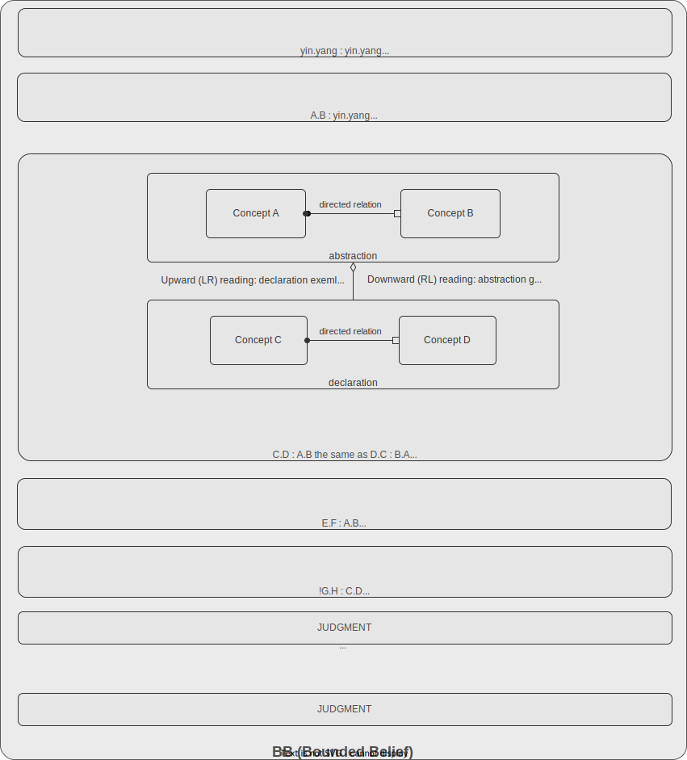

# BB Structure

Remember illustration of how BB could looks like from 'Knowledge anatomy' section. It shows complex semantic of knowledge but structurally BB is simple list of judgments:



## Valid BB state

A BB is valid when all of the following hold:

**Root** — every BB contains the primal self-referential judgment:
```
yin.yang:yin.yang
```
This is the single universal root from which all abstraction originates.

**Connectivity** — every judgment must have a path to the root. Isolated judgments are not invalid structurally, but carry no navigable meaning.

**Acyclicity** — BB must be a DAG. Cycles corrupt the one-way semantic of abstraction. The root self-reference is the only permitted exception.

**Polarity uniqueness** — a BB cannot contain the same judgment in both polarities simultaneously. `+j` and `−j` are mutually exclusive.

**No orphans** — when a judgment is retracted, any relations and concept lineages left unreferenced must be removed. There are no hanging relations or unused concepts in a valid BB.

---

## Valid cognitive act

A cognitive act is valid when it produces a BB state that satisfies all invariants above. Specifically:

| Act | Validity condition |
|---|---|
| reflex ± | judgment does not already exist with opposite polarity |
| negate | target judgment exists as `+j` |
| reclame | target judgment exists as `−j` |
| retract | cascade to orphans is applied |
---

## What the structural validation does not cover

The validation is structural and formal — it validates shape, not meaning. Several important responsibilities fall entirely outside it and remain the person's liability:

**Abstraction honesty** — validation cannot verify that a judgment truly expresses an abstracting relationship rather than a similarity, composition, analogy, or any other kind of relation. `engine.car:part.whole` is structurally valid whether or not the abstraction holds semantically. The person decides.

**Concept integrity** — the validation does not verify that a concept's description is accurate, complete, or semantically consistent with the judgments that reference it. A concept named *engine* could describe anything.

**Concept identity boundary** — when a concept has changed enough to become a new concept rather than a refined version of the old one, only the person can judge. The validation only records that an edit occurred; it does not evaluate whether the identity threshold was crossed.

**BB semantic coherence** — two judgments may be structurally valid individually while being semantically contradictory. The validation enforces polarity uniqueness for identical judgments, but cannot detect deeper semantic conflicts across different judgments.

These are not gaps — they are intentional bounds. Meaning is personal. Tooling may assist with semantic checks, but such tooling lives outthere.
